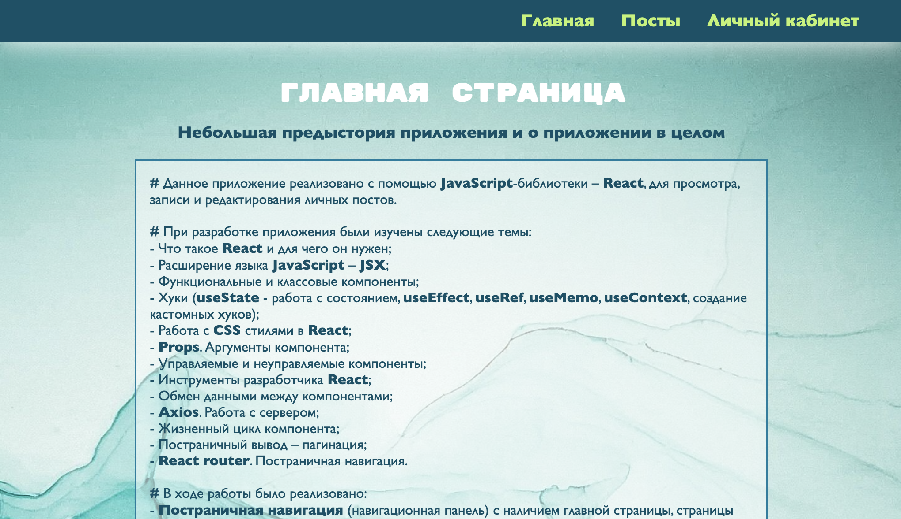
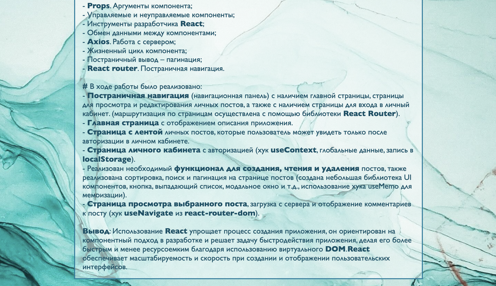
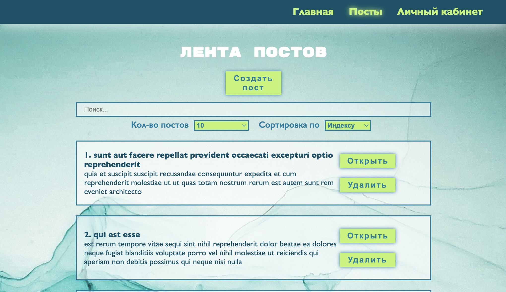
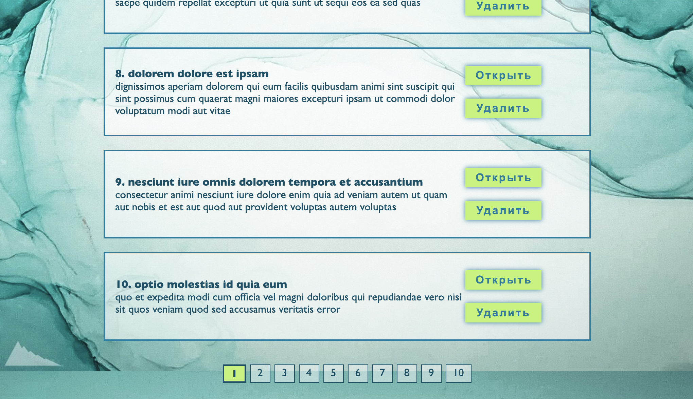
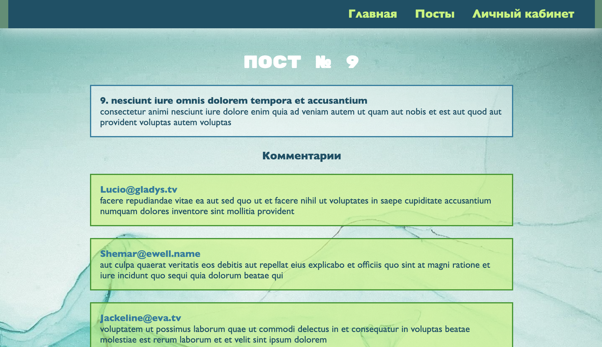

# React_Router

#### Данное приложение реализовано с помощью JavaScript-библиотеки – React, для просмотра, записи и редактирования личных постов.

<b>#</b> Данное приложение реализовано с помощью <b>JavaScript</b>
-библиотеки – <b>React</b>, для просмотра, записи и редактирования
личных постов.
 
 
<b>#</b> При разработке приложения были изучены следующие темы:
 - Что такое <b>React</b> и для чего он нужен;
 - Расширение языка <b>JavaScript</b> – <b>JSX</b>;
 - Функциональные и классовые компоненты;
 - Хуки (<b>useState</b> - работа с состоянием, <b>useEffect</b>,
<b>useRef</b>, <b>useMemo</b>, <b>useContext</b>, создание кастомных
хуков);
 - Работа с <b>CSS</b> стилями в <b>React</b>;
 - <b>Props</b>. Аргументы компонента;
 - Управляемые и неуправляемые компоненты;
 - Инструменты разработчика <b>React</b>;
 - Обмен данными между компонентами;
 - <b>Axios</b>. Работа с сервером;
 - Жизненный цикл компонента;
 - Постраничный вывод – пагинация;
 - <b>React router</b>. Постраничная навигация.
 
 
<b>#</b> В ходе работы было реализовано:
 - <b>Постраничная навигация</b> (навигационная панель) с
наличием главной страницы, страницы для просмотра и редактирования
личных постов, а также с наличием страницы для входа в личный кабинет.
(маршрутизация по страницам осуществлена с помощью библиотеки
<b>React Router</b>).
 - <b>Главная страница</b> с отображением описания приложения.
 - <b>Страница с лентой</b> личных постов, которые пользователь
может увидеть только после авторизации в личном кабинете.
 - <b>Страница личного кабинета</b> с авторизацией (хук
<b>useContext</b>, глобальные данные, запись в <b>localStorage</b>).
 - Реализован необходимый
<b>функционал для создания, чтения и удаления</b> постов, также
реализована сортировка, поиск и пагинация на странице постов (создана
небольшая библиотека UI компонентов, кнопка, выпадающий список,
модальное окно и т.д., использование хука useMemo для мемоизации).
 - <b>Страница просмотра выбранного поста</b>, загрузка с сервера
и отображение комментариев к посту (хук <b>useNavigate</b> из
<b>react-router-dom</b>). 
 
 
<b>Вывод</b>: Использование <b>React</b> упрощает процесс
создания приложения, он ориентирован на компонентный подход в
разработке и решает задачу быстродействия приложения, делая его более
быстрым и менее ресурсоемким благодаря использованию виртуального <b>DOM</b>.
<b>React</b> обеспечивает масштабируемость и скорость при создании и
отображении пользовательских интерфейсов.

### Главная страница 

#### _screenshot(1)_

#### _screenshot(2)_

### Страница постов без входа в личный аккаунт 

#### _screenshot(1)_

### Страница для входа в личный аккаунт  

#### _screenshot(1)_

#### _screenshot(2)_

### Страница постов с входом в личный аккаунт 

#### _screenshot(1)_

#### _screenshot(2)_

### Страница поста с комментариями 

#### _screenshot(1)_

### `npm start`

Runs the app in the development mode.
Open [http://localhost:3000](http://localhost:3000) to view it in your browser.